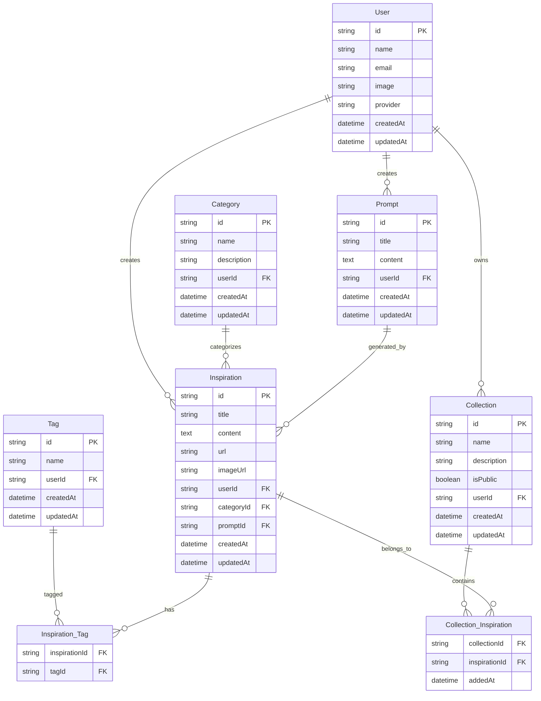

# 数据库设计

## ER图

## 模型说明

### User (用户)
存储系统用户信息，包括通过不同提供商登录的用户。

字段：
- id: 用户唯一标识符
- name: 用户名
- email: 邮箱地址
- image: 头像URL
- provider: 登录提供商 (email, google, github)
- createdAt: 创建时间
- updatedAt: 更新时间

### Inspiration (灵感)
核心实体，表示收集的灵感内容。

字段：
- id: 灵感唯一标识符
- title: 标题
- content: 内容描述
- url: 原始链接
- imageUrl: 图片URL
- userId: 关联的用户ID
- categoryId: 关联的分类ID
- promptId: 生成该灵感的提示词ID
- createdAt: 创建时间
- updatedAt: 更新时间

### Category (分类)
用户自定义的灵感分类。

字段：
- id: 分类唯一标识符
- name: 分类名称
- description: 描述
- userId: 所属用户ID
- createdAt: 创建时间
- updatedAt: 更新时间

### Tag (标签)
用于标记灵感的标签。

字段：
- id: 标签唯一标识符
- name: 标签名称
- userId: 所属用户ID
- createdAt: 创建时间
- updatedAt: 更新时间

### Inspiration_Tag (灵感-标签关联表)
多对多关系表，连接灵感和标签。

字段：
- inspirationId: 灵感ID
- tagId: 标签ID

### Collection (收藏集)
用户创建的灵感集合。

字段：
- id: 收藏集唯一标识符
- name: 名称
- description: 描述
- isPublic: 是否公开
- userId: 所属用户ID
- createdAt: 创建时间
- updatedAt: 更新时间

### Collection_Inspiration (收藏集-灵感关联表)
多对多关系表，连接收藏集和灵感。

字段：
- collectionId: 收藏集ID
- inspirationId: 灵感ID
- addedAt: 添加时间

### Prompt (提示词)
用户保存的AI提示词模板。

字段：
- id: 提示词唯一标识符
- title: 标题
- content: 提示词内容
- userId: 所属用户ID
- createdAt: 创建时间
- updatedAt: 更新时间